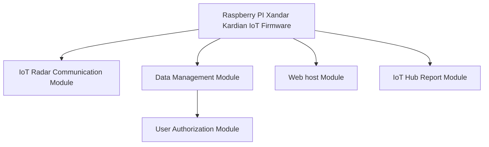
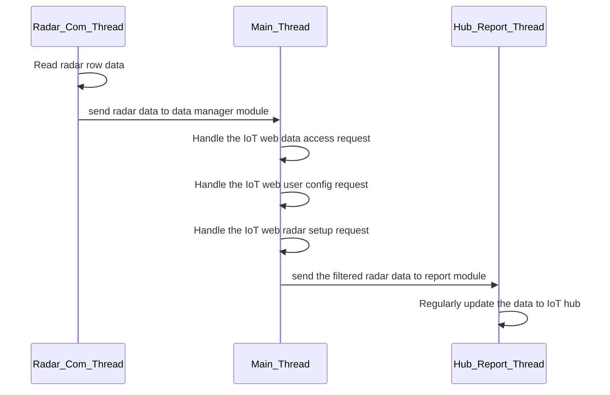

# People Detection Radar [IoT]

### Raspberry PI Xandar Kardian IoT People Count Radar


**Program Design Purpose**: 

People detection sensors and radars are utilized in various applications across multiple fields such as security and surveillance, healthcare, building automation, smart cities, transportation, and autonomous systems. This project aims to develop a prototype for an indoor people counting IoT device using the Xandar Kardian People Detection Radar and a Raspberry Pi. The device will be network-ready and easily integrated with other systems. The Python-based IoT firmware will run on the Raspberry Pi and provide the following functionalities:

1. Read raw data from the people detection radar to determine the number of people in an area.

2. Offer a web interface for users to view the data and adjust radar parameters.

3. Provide IoT data access authorization and interfaces for integration with other systems.

The system workflow is shown below : 


The project Python IoT firmware code is also modularized and flexible for user to plug their own sensors on Raspberry PI to build different kinds of customized IoT device. 

```
# Created:     2019/09/11 [ rebuilt from v1.5 on 22/06/2024 ]
# version:     v2.3 
# Copyright:   Copyright (c) 2024 LiuYuancheng
# License:     MIT License
```

**Table of Contents**

[TOC]

------

### Introduction

This project will create a prototype people count(detection) radar IoT with a website server to provide the live history chart to show the Xandar Kardian People counting sensor data. It is build by using one/two Xandar CT-100 people detection radar and one Raspberry PI. The firmware will run on Raspberry PI and contents five main modules: 




- **IoT Radar Communication Module** : Module used to connect to the Raspberry PI serial(COM) or GPIO port to fetch the radar raw data and convert to list of parameter value. 
- **IoT Data Management Module** : Module used to do radar data normalization and manage all the data update on the web UI. 
- **IoT User Authorization Module** : Provide a user authorization function with a data base for IoT admin to create, update and remove users and manage the data assessment for different users. 
- **IoT Web host Module** : Webhost module provide a website for user to view radar data, manage users and change radar setting, it also provide http(s) data GET API for other program to fetch data from the IoT
- **IoT Hub Report Module**: Module used to report the IoT data to IoT hub server regularly and fetch the IoT control commands.  

When the engineer are installing the  people count radar with its IOT device in the network. They don't need to use the computer to connect to the sensor directly to check the sensor state. They can use the login in the web sever running in the  IOT gateway to finish the job. The web side view is shown below:


#### Background Information Introduction

People detection sensors use various technologies, including infrared, ultrasonic, microwave, and video analytics, to detect and monitor human presence and movement. The choice of technology and application depends on the specific requirements and environment. In this project we use the microwave people detection radar which can be used in the dark area as an assist of the surveillance cameras. 

- Introduction of Xandar People Detection Radar : https://xkcorp.com/
- Introduction of Raspberry IoT:  https://www.raspberrypi.com/

The radar will provide 25 different measurement parameters:  `1: Idx People count` , `2: Human Presence`, `3: Program Version`, `4: ShortTerm avg`, `5: LongTerm avg`, `6: EnvMapping rm T`, `7: Radar Map rm T`, `8: Idx for radar mapping`, `9: Num of ppl for radar map`, `10: Start Rng`, `11: End Rng`, `12: Radar LED on/off`, `13: Trans period`, `14: Calib factor`, `15: Radar Tiled Angle`, `16: Radar Height`, `17: Avg size`, `18: Presence on/off`, `19: Final ppl num`, `20: Radar MP val`, `21: Env MP val`, `22: serial num_1`, `23: serial num_2`, `24: serial dist1`, `25: serial dist2`. 


#### Possible Usage Cases

In this project, we only use the people counting function (1 of the 30 parameters ) of the CT100 people detection radar. User can use the other data of the radar sensor to pivotal in enhancing security, improving energy efficiency, and providing valuable data for business and operational insights. We think there may be 10 fields where IoT people detection sensors can be used:

| Idx  | Use case type                           | Use case detail description                                  |
| ---- | --------------------------------------- | ------------------------------------------------------------ |
| 1    | Security and Surveillance               | Intruder detection and perimeter security especially in the dark area. |
| 2    | Building Automation and Smart Buildings | Optimize lighting control, AC Systems and access Control.    |
| 3    | Retail and Marketing                    | Customer counting, foot traffic analysis and queue management |
| 4    | Healthcare                              | Patient Monitoring, Staff Utilization and room occupancy     |
| 5    | Transportation                          | Passenger Counting, Crowd Management and Safety Systems      |
| 6    | Smart Cities                            | Public Space Management, Traffic Management, Emergency Response |
| 7    | Office Environments                     | Space Utilization and Energy Savings.                        |
| 8    | Hospitality                             | Guest Services, Security and Resource Management             |
| 9    | Industrial and Manufacturing            | worker Safety, Efficiency Monitoring and Asset Protection    |
| 10   | Residential                             | Home Automation, Elderly Care and Energy Management          |


------

### Program Design

The IoT firmware program is a multi-threading program. The IoT Radar Communication Module and IoT Hub report module will run in two parallel thread to automated fetch data from the radar senor and report the information to IoT hub.



##### Design of Radar Communication Module

This is the plug in hardware sensor communication interface module of the IoT frame work to read the raw bytes data from the Xandar people counting sensor via Raspberry PI's serial (COM) port or GPIO. For testing it also provide the simulation module to generate simulation data or replay the pre-saved data.  If user use other kinds of sensor, they can replay this module. 

##### Design of Data Management Module

The data management module will parse the data from the raw radar binary stream and normalized the data to get the parameters we need. It will also log the processed data in local histrion database. When the user access the IoT wei portal interface or call the data fetch API, the data manager will provide the related data based on the data access rule set by the admin. 

##### Design of User Authorization Module

The user authorization module will be keep a user DB and handle all the user create, update and remove request from the web interface. It will also provide the user data access limitation based on the admin's setting. For normal user, then can only check the data and access the "visible" data admin configured, for the admin user they can access all the data.

##### Design of Web host Module 

The python flask webhost module provide a website for user to view radar data, manage users and change radar setting, it also provide http(s) data GET API for other program to fetch data from the IoT, It will provide 5 different web interfaces for user: 

- Home page : to check the IoT radar introduction and external link of the device. If use login the link to other IoT such as data config page will show up. 
- Login page : for user to login the IoT. 
- Data Chat: A chat to dynamically show the data in real time. (This page can be access by all the users)
- Data page: A table show all the 35 radar parameters in real lift, admin can config to show one of the parameters on the data chat page. 
- User management page: only accessible by admin user to create, update and remove user. 
- IoT config page: set the data read frequency, data can be access by users and the config the report hub information. 

##### Design of Hub Report Module

The hub report module will run parallel with the main thread to report the IoT information to IoT hub, we provide the Http(s) communication normal TCP or UDP connection for user to choose. 


------

### Program Setup

If you want to use the system, please follow below section to setup and use the API

**Development/Execution Environment**

- python 3.7.4+

**Additional Lib/Software Need** 

| Lib Module   | Version | Installation                     | Lib link                                                |
| ------------ | ------- | -------------------------------- | ------------------------------------------------------- |
| **Flask**    | 1.1.2   | `pip install Flask`              | https://flask.palletsprojects.com/en/3.0.x/             |
| **pySerial** | 3.0.1   | `python -m pip install pyserial` | https://pyserial.readthedocs.io/en/latest/pyserial.html |

##### Hardware Need

1. Raspberry PI 3 B+ (used as IOT gateway) : https://www.raspberrypi.org/products/raspberry-pi-3-model-b-plus/ 

2. Xandar Kardian People counting Radar CT100: http://xandar.com/people-counting/ 

The hardware connection is show below: 


**Program Files List** 

| Program File            | Execution Env | Description                                                  |
| ----------------------- | ------------- | ------------------------------------------------------------ |
| lib/ConfigLoader.py     | python 3      | Loader module to read the user name and password information. |
| src/user.json           | python 3      | User DB file to save user and password.                      |
| src/XAKAsensorComm.py   | python 3      | Sensor communication interface module.                       |
| src/XAKAsensorGlobal.py | python 3      | Global parameters module.                                    |
| src/XandaWebAuth        | python 3      | User Authorization module.                                   |
| src/XandaWebHost.py     | python 3      | Main IoT web host program.                                   |
| src/templates/*.html    |               | All the html web pages.                                      |
| src/static              |               | static files storage folder such as css, image file.         |
|                         |               |                                                              |


------

### Program Usage/Execution

###### Program execution cmd: 

```
python XandaWebHost.py
```

###### Usage : 

Type in the URL [IPaddr:5000] (http://127.0.0.1:5000/) in your browser then the page will shown as below: 

 

Then click the Login link and type in the username/password for authorization: 


After type in the correct user name and password, the people counting sensor main page will show. 


### Problem and Solution

N.A

------

### Reference

Xandar Kardian people counting sensors : https://www.xkcorp.com/

------

> Last edit by LiuYuancheng(liu_yuan_cheng@hotmail.com) at 31/01/2022

