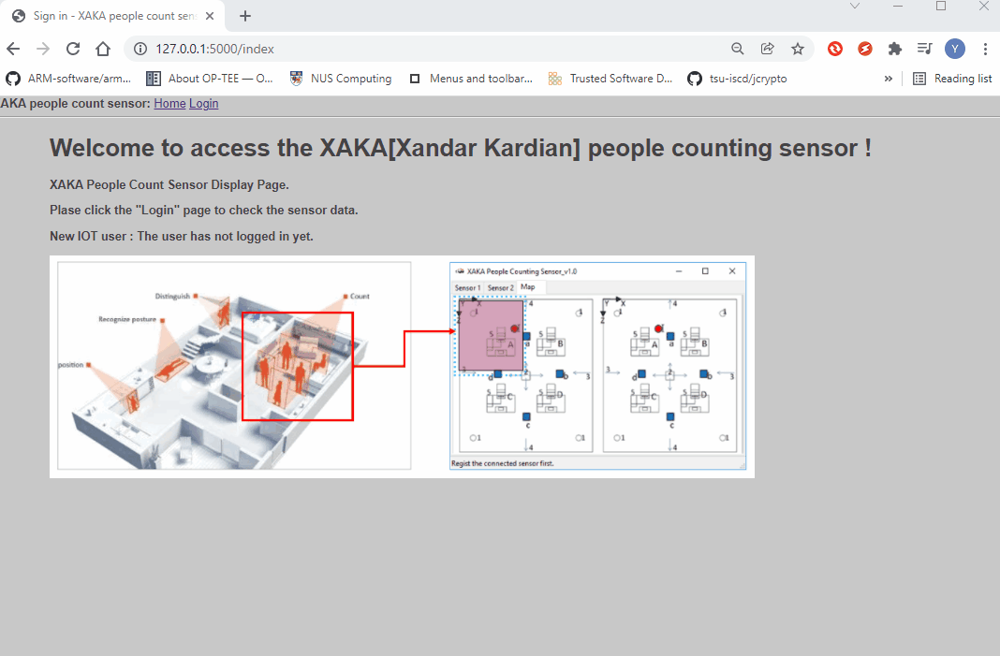
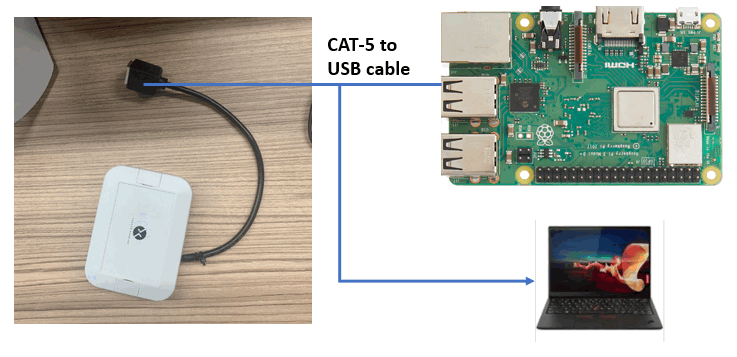
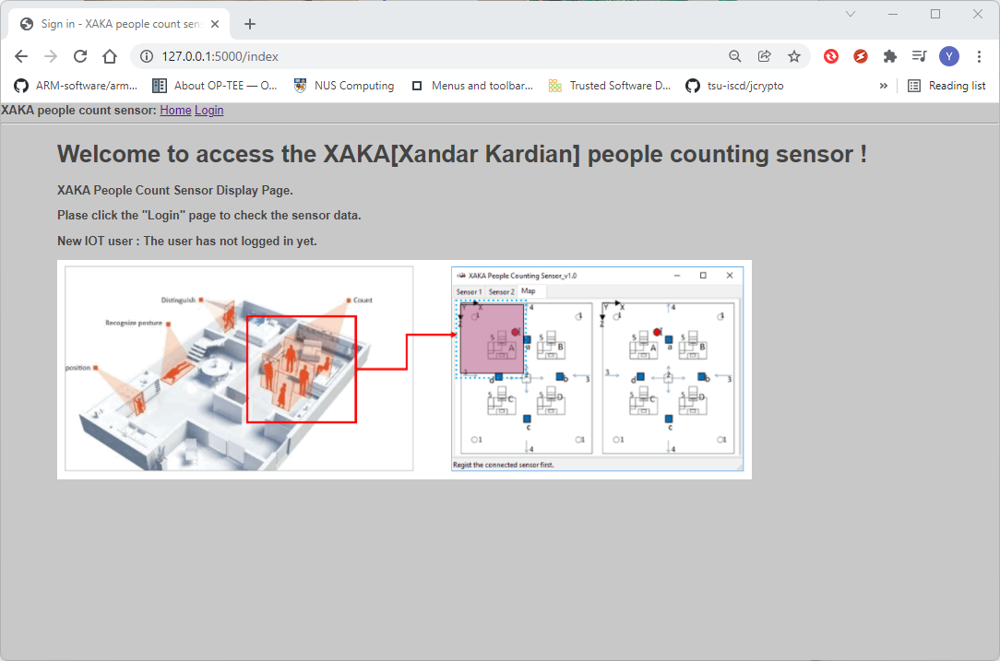
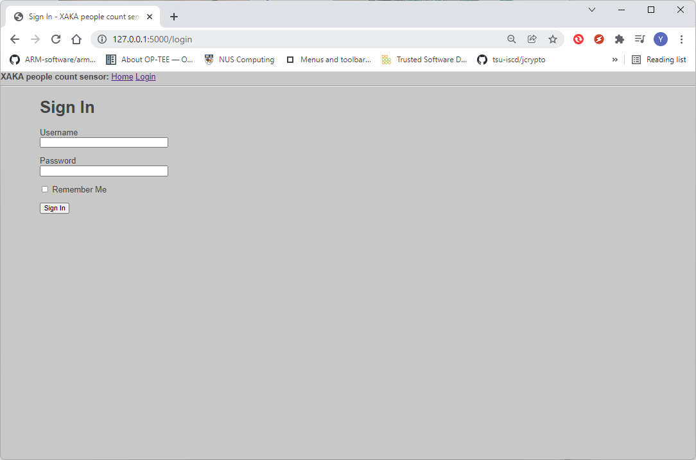
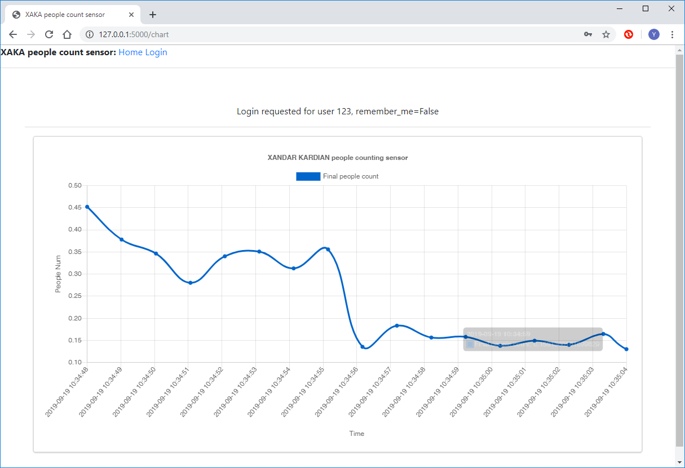

# Xandar_Sensor_Webd

**Program Design Purpose**: We want to create an web host to visualize Xandar Kardian people counting sensors detection result for a indoor area. 

[TOC]

### Introduction

This project will create a simple web server to provide the history chart to show the Xandar Kardian People counting sensor data.  So when the engineer are installing the sensor with its IOT gateway. They don't need to use the computer to connect to the sensor directly to check the sensor state. They can login in the web sever running in the  IOT gateway to finish the job.

Xandar Kardian people counting sensors introduction : http://xandar.com/people-counting/

##### Web Main UI View 



`version: v_2.1`


------

### Program Design

The web host program contents three main section

##### Sensor data collection module 

This module will normalized the reading data from the sensor and get the final people count. 

##### Web host module 

This module will provide a web host program to do the use authorization, result visualization.   


------

### Program Setup

###### Development env: Python 3.7

###### Additional Lib need: 

1. Flask 1.1.1 (buil Web-Server lib need to be installed)

   [Flask]: https://pypi.org/project/Flask/:	"Flask"

   ```
   pip install -U Flask
   ```

###### Hardware Need:

1. Raspberry PI 3 B+ (used as IOT gateway)

   [Raspberry PI]: https://www.raspberrypi.org/products/raspberry-pi-3-model-b-plus/	"IOT gateway"

2. Xandar Kardian People counting sensor.

   [Xandar Kardian]: http://xandar.com/people-counting/	"People counting sensor"
   
   

###### Program Files List 

| Program File            | Execution Env | Description                                                  |
| ----------------------- | ------------- | ------------------------------------------------------------ |
| src/ConfigLoader.py     | python 3      | Loader module to read the user name and password information. |
| src/ConfigUser.txt      |               | Save user and password.                                      |
| src/XAKAsensorComm.py   | python 3      | Sensor communication interface module.                       |
| src/XAKAsensorGlobal.py | python 3      | Global parameters module.                                    |
| src/XandaWebHost.py     | python 3      | Web host program.                                            |
| src/templates/*.html    |               | All the html web pages.                                      |
| src/static              |               | static files storage folder such as css, image file.         |
|                         |               |                                                              |

------

### Program Usage/Execution

###### Program execution cmd: 

```
python XandaWebHost.py
```

###### Usage : 

Type in the URL [IPaddr:5000] (http://127.0.0.1:5000/) in your browser then the page will shown as below: 

 

Then click the Login link and type in the username/password for authorization: 



After type in the correct user name and password, the people counting sensor main page will show. 




### Problem and Solution

N.A

------

### Reference

Xandar Kardian people counting sensors : https://www.xkcorp.com/

------

> Last edit by LiuYuancheng(liu_yuan_cheng@hotmail.com) at 31/01/2022

