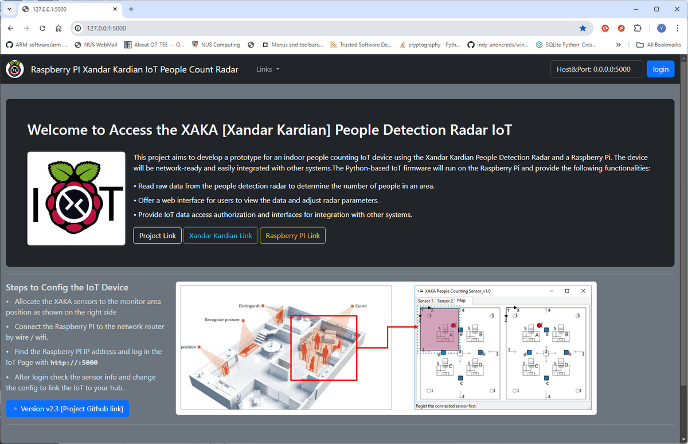

# People Detection Radar [IoT]

### Raspberry PI Xandar Kardian IoT People Count Radar


**Program Design Purpose**: 

People detection sensors and radars are utilized in various applications across multiple fields such as security and surveillance, healthcare, building automation, smart cities, transportation and autonomous manufacturing systems. This project aims to develop a prototype  IoT device for an indoor people counting using the Xandar Kardian people detection radar and a Raspberry Pi. The device will be network-ready and easily integrated with other systems. The Python-based IoT firmware will run on the Raspberry Pi and provide the following functionalities:

1. Read raw data from the people detection radar to determine the number of people in an area.

2. Offer a web interface for users to view the data and adjust radar parameters.

3. Provide IoT data access authorization and interfaces for integration with other systems.

The IoT device program workflow is shown below : 


` Figure-00: IoT device program system diagram, version v2.3 (2024)`

The project's Python IoT firmware code is also modularized and flexible for user to plug their own sensors on Raspberry PI to build different kinds of customized IoT device. 

```
# Created:     2019/09/11 [ rebuilt from v1.5 on 22/06/2024 ]
# version:     v2.3 
# Copyright:   Copyright (c) 2024 LiuYuancheng
# License:     MIT License
```

**Table of Contents**

[TOC]

------

### Introduction

This project aims to develop a prototype for a people counting radar IoT device with a web server to provide live and historical data visualization for the Xandar Kardian People Counting Sensor. The system will utilize one or two Xandar CT-100 people detection radars and a Raspberry Pi. The firmware running on the Raspberry Pi will consist of five main modules:


` Figure-01: IoT device program hierarchy diagram, version v2.3 (2024)`

- **IoT Radar Communication Module** : Connects to the Raspberry Pi's serial (COM) or GPIO port to fetch raw radar data and convert it into a list of parameter values.
- **IoT Data Management Module** : Normalizes radar data and manages all data updates on the web UI.
- **IoT User Authorization Module** : Provides user authorization functions with a database for IoT administrators to create, update, and remove users, and manage data access for different users.
- **IoT Web host Module** : Hosts a website for users to view radar data, manage users, and change radar settings. It also provides HTTP(S) data GET APIs for other programs to fetch data from the IoT system.
- **IoT Hub Report Module**: Reports IoT data to the IoT hub server regularly and fetches IoT control commands.

When engineers install the people counting radar with its IoT device on the network, they do not need to connect a computer directly to the sensor to check its status. Instead, they can use their phone  log in to the web server running on the IoT gateway to complete the setup. The web interface is shown below:


` Figure-02: IoT web interface usage diagram, version v2.3 (2024)`


#### Background Information Introduction

People detection sensors use various technologies, including infrared, ultrasonic, microwave, and video analytics, to detect and monitor human presence and movement. The choice of technology and application depends on the specific requirements and environment. In this project we use the microwave people detection radar which can be used in the dark area as an assist of the surveillance cameras. 

- Introduction of Xandar People Detection Radar : https://xkcorp.com/
- Introduction of Raspberry IoT:  https://www.raspberrypi.com/

The radar will provide 25 different measurement parameters for user to selection:

`1: Idx People count` , `2: Human Presence`, `3: Program Version`, `4: ShortTerm avg`, `5: LongTerm avg`, `6: EnvMapping rm T`, `7: Radar Map rm T`, `8: Idx for radar mapping`, `9: Num of ppl for radar map`, `10: Start Rng`, `11: End Rng`, `12: Radar LED on/off`, `13: Trans period`, `14: Calib factor`, `15: Radar Tiled Angle`, `16: Radar Height`, `17: Avg size`, `18: Presence on/off`, `19: Final ppl num`, `20: Radar MP val`, `21: Env MP val`, `22: serial num_1`, `23: serial num_2`, `24: serial dist1`, `25: serial dist2`. 


#### Possible Usage Cases

In this project, we will utilize the people counting function (one of the 25 parameters) of the CT100 people detection radar. Users can leverage the other data from the radar sensor to enhance security, improve energy efficiency, and gain valuable business and operational insights. We believe there are at least 10 fields where IoT people detection sensors can be effectively used.

| Idx  | Use case type                           | Use case detail description                                  |
| ---- | --------------------------------------- | ------------------------------------------------------------ |
| 1    | Security and Surveillance               | Intruder detection and perimeter security especially in the dark area. |
| 2    | Building Automation and Smart Buildings | Optimize lighting control, AC Systems and door  access control. |
| 3    | Retail and Marketing                    | Customer counting, foot traffic analysis and queue management. |
| 4    | Healthcare                              | Patient monitoring, staff utilization and room occupancy     |
| 5    | Transportation                          | Passenger counting, crowd management and safety systems control |
| 6    | Smart Cities                            | Public space management, traffic management, emergency response |
| 7    | Office Environments                     | Space utilization and energy savings.                        |
| 8    | Hospitality                             | Guest services, security and resource management             |
| 9    | Industrial and Manufacturing            | Worker safety, efficiency monitoring and asset protection    |
| 10   | Residential                             | Home automation, elderly care and energy management          |


------

### Program Design

The IoT firmware is a multi-threaded program. The `IoT Radar Communication Module` and `IoT Hub Report Module` run in parallel threads to automatically fetch data from the radar sensor and report the information to the IoT hub.


` Figure-03: Program progress steps UML diagram, version v2.3 (2024)`

##### Design of Radar Communication Module

This module serves as the hardware radar communication interface within the IoT framework. It reads raw byte data from the Xandar people counting sensor via the Raspberry Pi's serial (COM) port or GPIO. For testing, it also provides a simulation module to generate simulated data or replay pre-saved data. Users can replace this module with their sensor driver module if they wish to use different types of sensors.

##### Design of Data Management Module

The Data Management Module parses raw radar binary streams and normalizes the data to obtain the required parameters. It logs the processed data in a local history database. When users access the IoT web portal interface or call the data fetch API, the Data Manager provides the relevant data based on the access rules set by the admin.

##### Design of User Authorization Module

The User Authorization Module maintains a user database and handles all user creation, update, and removal requests from the web interface. It enforces user data access limitations based on the admin's settings. Normal users can only check and access "visible" data configured by the admin, while admin users have access to all data.

##### Design of Web host Module 

The Python Flask Web Host Module provides a website for users to view radar data, manage users, and change radar settings. It also provides HTTP(S) data GET APIs for other programs to fetch data from the IoT. It offers five different web interfaces for users:

- **Home Page**: Displays an introduction to the IoT radar and external links. Logged-in users can access additional links such as the data configuration page.
- **Login Page**: For users to log in to the IoT system.
- **Data Chart**: Displays data dynamically in real time. (This page can be access by all the users)
- **Data Page**: A table showing all 25 radar parameters in real time. Admins can configure which parameters are displayed on the Data Chart page.
- **User Management Page**: Accessible only by admin users for creating, updating, and removing users.
- **IoT Config Page**: Allows setting data read frequency, user data access permissions, and configuring report hub information.

##### Design of Hub Report Module

The Hub Report Module runs parallel to the main thread to report IoT information to the IoT hub. It supports HTTP(S) communication as well as normal TCP or UDP connections, allowing users to choose their preferred method.


------

### Program Setup

If you want to use the system, please follow below section to setup and use the API

##### Development/Execution Environment

- python 3.7.4+

##### Additional Lib/Software Need 

| Lib Module   | Version | Installation                     | Lib link                                                |
| ------------ | ------- | -------------------------------- | ------------------------------------------------------- |
| **Flask**    | 1.1.2   | `pip install Flask`              | https://flask.palletsprojects.com/en/3.0.x/             |
| **pySerial** | 3.0.1   | `python -m pip install pyserial` | https://pyserial.readthedocs.io/en/latest/pyserial.html |

##### Hardware Need

1. Raspberry PI 3 B+ (used as IOT gateway) : https://www.raspberrypi.org/products/raspberry-pi-3-model-b-plus/ 

2. Xandar Kardian People counting Radar CT100: http://xandar.com/people-counting/ 

The hardware connection is show below: 


##### Program Files List 

| Program File             | Execution Env | Description                                                  |
| ------------------------ | ------------- | ------------------------------------------------------------ |
| lib/ConfigLoader.py      | python 3      | Loader module to read the user name and password information. |
| src/user.json            |               | User DB file to save user and password.                      |
| src/ Config_template.txt |               | config file template                                         |
| src/XAKAsensorComm.py    | python 3      | Sensor communication interface module.                       |
| src/XAKAsensorGlobal.py  | python 3      | Global parameters module.                                    |
| src/XandaWebAuth         | python 3      | User Authorization module.                                   |
| src/XandaWebHost.py      | python 3      | Main IoT web host program.                                   |
| src/templates/*.html     |               | All the html web pages.                                      |
| src/static               |               | static files storage folder such as css, image file.         |
|                          |               |                                                              |


------

### Program Usage/Execution

#### Run IoT Firmware

**Step 1: Setup the config file**

Rename the `Config_template.txt` to Config.txt and set the parameters based on your requirement (as shown in the example below if don't config the radar port the firmware will search all the connectable port) : 

```
# This is the config file template for the module <c2App.py>
# Setup the parameter with below format (every line follows <key>:<val> format, the
# key can not be changed):
#-----------------------------------------------------------------------------
# Test mode flag, 
# - True: the program will simulate connected to a Xanda radar sensor via COM port
# - False: the program will connect to a Xanda radar sensor via COM port. 
TEST_MD:True
#-----------------------------------------------------------------------------
# IoT Admin user config and user record file. 
ADMIN_USER:admin
ADMIN_PASSWD:admin
USERS_RCD:users.json
#-----------------------------------------------------------------------------
# Radar information.
RADAR_TYPE:CT100
RADAR_PORT:COM3
RADAR_UPDATE_INTERVAL:1
#-----------------------------------------------------------------------------
# IoT Hub configuration.
RPT_MD:False
RPT_INT:5
RPT_SER_IP:127.0.0.1
RPT_SER_PORT:5001
#-----------------------------------------------------------------------------
# Init the Flask app parameters
FLASK_SER_PORT:5000
FLASK_DEBUG_MD:False
FLASK_MULTI_TH:True
```

**Step 2: Execute the IoT firmware** 

```
python XandaWebHost.py
```

Type in the URL [IPaddr:5000] (http://127.0.0.1:5000/) in your browser then the page will shown as below: 



` Figure-04: IoT radar home page screen shot , version v2.3 (2024)`

**Step 3: Use Web API to fetch the data**  

If you want to fetch the radar data from the IoT, send the HTTP GET request with a valid user name and password as shown below: 

```
requests.get(http://%s:%s/getLastData, json={'user':<>, 'password':<>})
```

Then you will get the latest radar data and the time stamp, the data list sequence will follow the background's 25 data parameter sequence.

```
{"time": (timestamp_string), "data": (dataList)}
```


#### Use the Web Interface 

To use the IoT web interface, use need to login as user or admin, click the "login" button on the top right side of the web page: 


` Figure-05: IoT radar login page screen shot , version v2.3 (2024)`

 If login successful, the function access link (green color) will be shown on the home page: 


` Figure-06: Home page screen shot after login, version v2.3 (2024)`

Click the "Link to IoT Data and Config", then can go to the people count display chat page: 


` Figure-07: IoT people count chart page screen shot, version v2.3 (2024)`

If you want to check more radar data, else the "All Radar Data" from the navigation bar:


` Figure-08: IoT people all radar data page screen shot, version v2.3 (2024)`

To set the radar data update rate, go to the IoT configuration page. The user can also set the normalized parameters with the check box and configure the IoT hub IP and port, then the IoT will keep update the radar data to the Hub. 

 

` Figure-08: IoT configuration page screen shot, version v2.3 (2024)`

------

### Problem and Solution

If you got any problem or bug during the usage, please refer to `doc/ProblemAndSolution.md` to check whether there is any similar problem and we will provide the solution. 


------

### Reference

-  Xandar People Detection Radar : https://xkcorp.com/

- Raspberry IoT:  https://www.raspberrypi.com/

  

------

> Last edit by LiuYuancheng(liu_yuan_cheng@hotmail.com) at 23/06/2024, if you have any problem or find anu bug, please send me a message .

